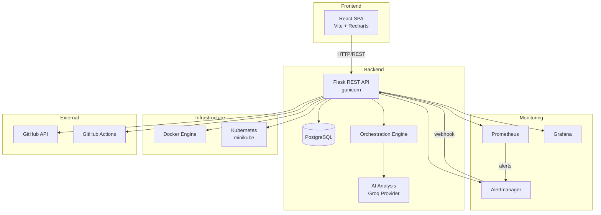
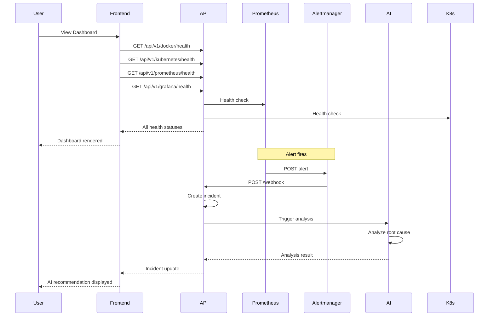
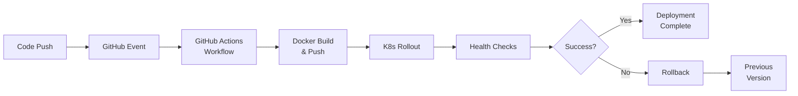
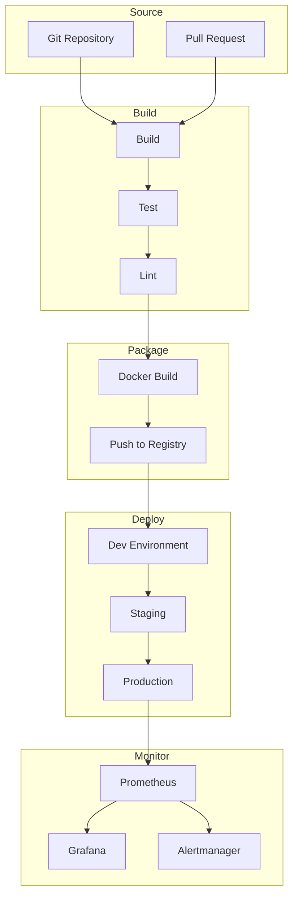
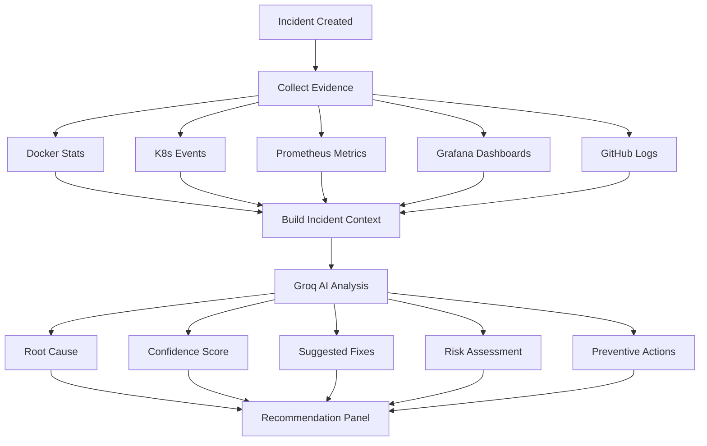
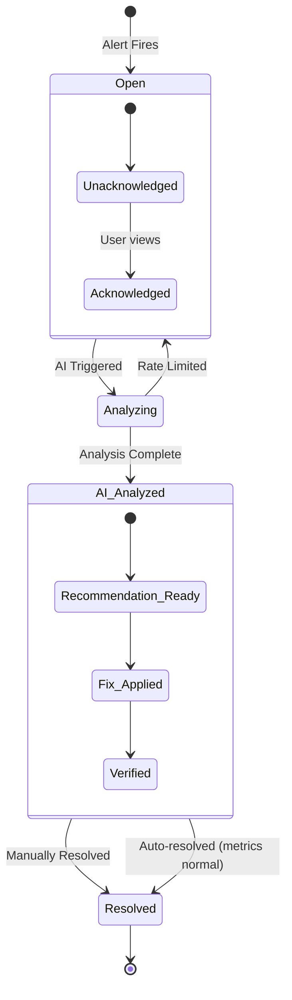
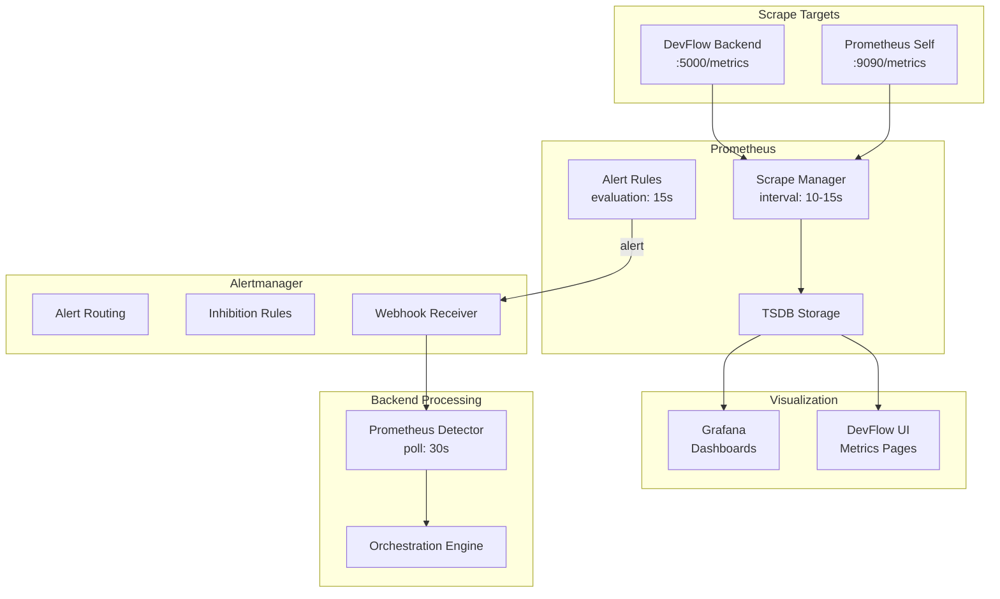
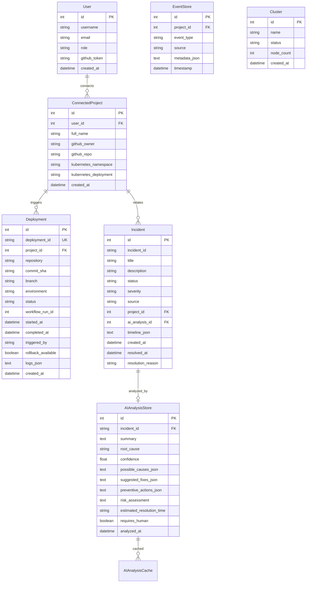

# DevFlow Architecture Diagrams

## System Architecture



## Sequence Diagram



## Deployment Workflow



## CI/CD Pipeline



## AI RCA Flow



## Incident Lifecycle



## Monitoring Architecture



## Microservice Interaction

```mermaid
graph TB
    subgraph Services
        AUTH[Auth Service]
        DOCKER_SVC[Docker Service]
        K8S_SVC[Kubernetes Service]
        PROM_SVC[Prometheus Service]
        GRAF_SVC[Grafana Service]
        ALERT_SVC[Alertmanager Service]
        GH_SVC[GitHub Service]
        INC_SVC[Incident Service]
        DEP_SVC[Deployment Service]
    end

    subgraph Routes
        AUTH_R["/auth/*"]
        DOCKER_R["/docker/*"]
        K8S_R["/kubernetes/*"]
        PROM_R["/prometheus/*"]
        GRAF_R["/grafana/*"]
        ALERT_R["/alertmanager/*"]
        GH_R["/github/*"]
        INC_R["/incidents/*"]
        DEP_R["/deployments/*"]
        ORCH_R["/orchestration/*"]
        ANALYTICS_R["/analytics/*"]
        DIAG_R["/diagnostics/*"]
    end

    AUTH_R --> AUTH
    DOCKER_R --> DOCKER_SVC
    K8S_R --> K8S_SVC
    PROM_R --> PROM_SVC
    GRAF_R --> GRAF_SVC
    ALERT_R --> ALERT_SVC
    GH_R --> GH_SVC
    INC_R --> INC_SVC
    DEP_R --> DEP_SVC

    ORCH_R --> INC_SVC
    ORCH_R --> K8S_SVC
    ORCH_R --> PROM_SVC
    ORCH_R --> DOCKER_SVC

    ANALYTICS_R --> DEP_SVC
    ANALYTICS_R --> INC_SVC
    ANALYTICS_R --> K8S_SVC

    DIAG_R --> AUTH
    DIAG_R --> DOCKER_SVC
    DIAG_R --> K8S_SVC
    DIAG_R --> PROM_SVC
    DIAG_R --> GRAF_SVC
    DIAG_R --> ALERT_SVC
    DIAG_R --> GH_SVC
```



## Database ER Diagram



## Component Diagram

```mermaid
graph TB
    subgraph Pages
        DASHBOARD[Dashboard]
        DEPLOY[Deployments]
        CLUSTER[Kubernetes]
        INCIDENTS[Incidents]
        MONITOR[Observability]
        METRICS[Metrics]
        GRAFANA[Grafana Dashboards]
        ALERTS[Active Alerts]
        ANALYTICS[Analytics]
        DIAGNOSTICS[Diagnostics]
        ARCHITECTURE[Architecture]
        TIMELINE[Activity Timeline]
        GITHUB[GitHub]
        REPOS[Repositories]
        RCA[AI Analysis]
    end

    subgraph Components
        STATCARD[StatCard]
        DATATABLE[DataTable]
        LOGVIEWER[LogViewer]
        EMPTYSTATE[EmptyState]
        LOADING[LoadingSpinner]
        SKELETON[LoadingSkeleton]
        TOAST[ToastContainer]
        NETERROR[NetworkError]
        SIDEBAR[Sidebar]
        CHART[ResourceChart]
    end

    subgraph Services
        API_SVC[api.js]
        DOCKER_SVC[dockerService.js]
        K8S_SVC[kubernetesService.js]
        PROM_SVC[prometheusService.js]
        GRAF_SVC[grafanaService.js]
        ALERT_SVC[alertmanagerService.js]
        DEPLOY_SVC[deploymentService.js]
        INC_SVC[incidentService.js]
        ANAL_SVC[analyticsService.js]
        DIAG_SVC[diagnosticsService.js]
        ORCH_SVC[orchestrationService.js]
    end

    DASHBOARD --> STATCARD
    DASHBOARD --> NETERROR
    DASHBOARD --> LOADING
    DASHBOARD --> API_SVC

    DEPLOY --> DATATABLE
    DEPLOY --> STATCARD
    DEPLOY --> LOGVIEWER
    DEPLOY --> DEPLOY_SVC

    CLUSTER --> DATATABLE
    CLUSTER --> K8S_SVC

    INCIDENTS --> INC_SVC

    MONITOR --> STATCARD
    MONITOR --> PROM_SVC
    MONITOR --> GRAF_SVC
    MONITOR --> ALERT_SVC

    ANALYTICS --> ANAL_SVC
    ANALYTICS --> CHART

    DIAGNOSTICS --> DIAG_SVC

    TIMELINE --> ORCH_SVC

    SIDEBAR -->|Navigation| PAGES
    TOAST -->|Notifications| PAGES
    LOADING -->|Loading| PAGES
    SKELETON -->|Skeleton| PAGES
    EMPTYSTATE -->|Empty| PAGES
    NETERROR -->|Error| PAGES
```



## Container Architecture (Docker Compose)

```mermaid
graph TB
    subgraph docker-compose.yml
        NET[devflow_net<br/>bridge network]

        subgraph Services
            POSTGRES[postgres:15-alpine<br/>:5432]
            BACKEND[backend<br/>:5000]
            FRONTEND[frontend<br/>:8081]
            PROM[prom/prometheus:latest<br/>:9090]
            GRAF[grafana/grafana:latest<br/>:3000]
            ALERTMAN[prom/alertmanager:latest<br/>:9093]
        end

        subgraph Volumes
            PG_DATA[postgres_data]
            DEVFLOW_DB[devflow_db]
            PROM_DATA[prometheus_data]
            GRAF_DATA[grafana_data]
            ALERT_DATA[alertmanager_data]
        end

        subgraph Config
            PROM_YML[./monitoring/prometheus.yml]
            RULES_YML[./monitoring/prometheus-alert-rules.yml]
            AM_YML[./monitoring/alertmanager/alertmanager.yml]
            DS_YML[./monitoring/grafana/datasources/prometheus.yml]
            KUBECONFIG[./monitoring/kubeconfig-docker.yml]
            ENV_FILE[./backend/.env]
            DOCKER_SOCK[/var/run/docker.sock]
        end
    end

    POSTGRES --> NET
    BACKEND --> NET
    FRONTEND --> NET
    PROM --> NET
    GRAF --> NET
    ALERTMAN --> NET

    BACKEND --> PG_DATA
    BACKEND --> DEVFLOW_DB
    BACKEND --> DOCKER_SOCK
    BACKEND --> KUBECONFIG
    BACKEND --> ENV_FILE

    PROM --> PROM_DATA
    PROM --> PROM_YML
    PROM --> RULES_YML

    GRAF --> GRAF_DATA
    GRAF --> DS_YML

    ALERTMAN --> ALERT_DATA
    ALERTMAN --> AM_YML

    BACKEND -.->|healthcheck| POSTGRES
    BACKEND -.->|healthcheck| PROM
    BACKEND -.->|healthcheck| GRAF
    BACKEND -.->|healthcheck| ALERTMAN
    FRONTEND -.->|depends_on| BACKEND
    PROM -.->|scrape| BACKEND
    PROM -.->|alerts| ALERTMAN
    ALERTMAN -.->|webhook| BACKEND
```
